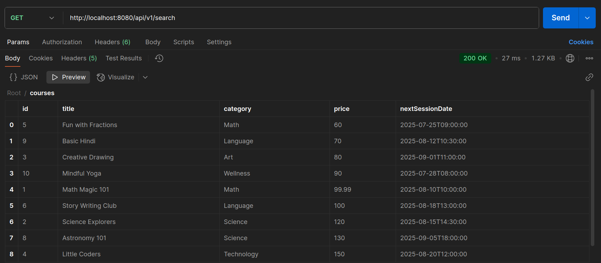
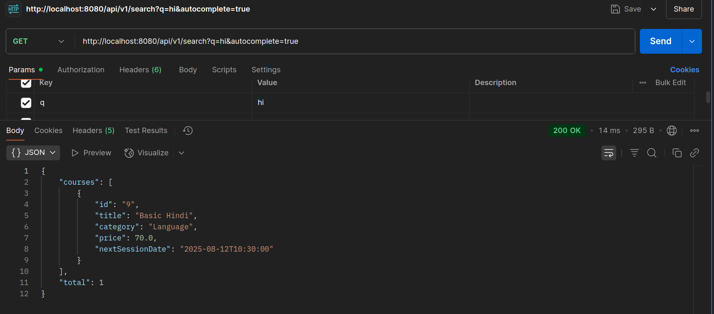

# 🧠 Course Search API with Spring Boot & Elasticsearch

This is a **Spring Boot application** that demonstrates **full-text search**, **filtering**, **sorting**, and **autocomplete suggestions** using **Elasticsearch 8+** and **Spring Data Elasticsearch 5+**.

## 🚀 Features

- Full-text search on course titles and descriptions.
- Filter courses by:
  - Category
  - Type (online/offline)
  - Age range
  - Price range
  - Start date
- Sort results by price (`asc` or `desc`).
- Autocomplete (bonus): Get course suggestions as you type.
- Clean JSON response with only needed fields.

---

## 🛠️ Tech Stack

- Java 17+
- Spring Boot 3+
- Spring Data Elasticsearch 5+
- Elasticsearch 8.12+
- Maven
- Docker (for Elasticsearch)

---

## ⚙️ Prerequisites

- Java 17 or higher
- Maven
- Docker (for running Elasticsearch locally)

---

## 🐳 Setup Elasticsearch via Docker

```bash
docker run -d --name elasticsearch \
  -p 9200:9200 \
  -e "discovery.type=single-node" \
  -e "xpack.security.enabled=false" \
  docker.elastic.co/elasticsearch/elasticsearch:8.12.0
```

Verify it’s up:

```bash
curl http://localhost:9200
```

You should see basic info like cluster name and version.

---

## 🔧 Spring Boot Setup

1. Clone the project:
   ```bash
   git clone https://github.com/your-repo/course-search-api.git
   cd course-search-api
   ```


3. Run the application:

```bash
./mvnw spring-boot:run
```

---

## 🧪 Testing API Endpoints

### 🔎 1. Search Courses

**Endpoint:**

```
GET /api/v1/search
```

**Sample Request:**

```bash
curl "http://localhost:8080/api/v1/search?q=physics&category=science&minAge=10&maxPrice=1000&sortDirection=desc&page=0&size=5"
```

**Expected Response:**

```json
{
  "total": 2,
  "courses": [
    {
      "id": "1",
      "title": "Advanced Physics",
      "category": "science",
      "price": 950.0,
      "nextSessionDate": "2025-08-10T00:00:00"
    }
  ]
}
```

✅ Response includes:
- Correct total hit count
- Filtered and sorted results
- Only required fields returned

---

### 💡 2. Autocomplete Suggest (Bonus)

**Endpoint:**

```
GET /api/v1/suggest?q=phy
```

**Sample Request:**

```bash
curl "http://localhost:8080/api/v1/suggest?q=phy"
```

**Expected Response:**

```json
{
  "suggestions": ["Physics 101", "Physical Chemistry", "Physiology for Beginners"]
}
```

✅ Matches based on partial input using `prefix` query.

---

## 📦 Sample SearchRequest Object (mapped from query params)

| Field           | Type    | Description                          |
|----------------|---------|--------------------------------------|
| q              | String  | Full-text search keyword             |
| category       | String  | Filter by course category            |
| type           | String  | Filter by course type (online/offline) |
| minAge         | Integer | Minimum age                          |
| maxAge         | Integer | Maximum age                          |
| minPrice       | Double  | Minimum price                        |
| maxPrice       | Double  | Maximum price                        |
| startDate      | LocalDateTime | Filter courses starting after this |
| sortDirection  | String  | `asc` or `desc` (price sorting)      |
| page           | Integer | Page number (default 0)              |
| size           | Integer | Page size (default 10)               |

---

## 🗃️ Index Mapping Note

Ensure that your Elasticsearch index has correct mappings, especially for:

```json
"nextSessionDate": {
  "type": "date",
  "format": "strict_date_time||yyyy-MM-dd'T'HH:mm:ss||yyyy-MM-dd"
}
```

This ensures correct parsing for `LocalDateTime`.


## 🏁 Final Notes

- ✅ Project follows best practices using `ElasticsearchOperations` and Criteria API.
- ✅ Clean controller-service separation.
- ✅ Extensible for future features like multi-index search or role-based filtering.

---


```markdown



```

---

